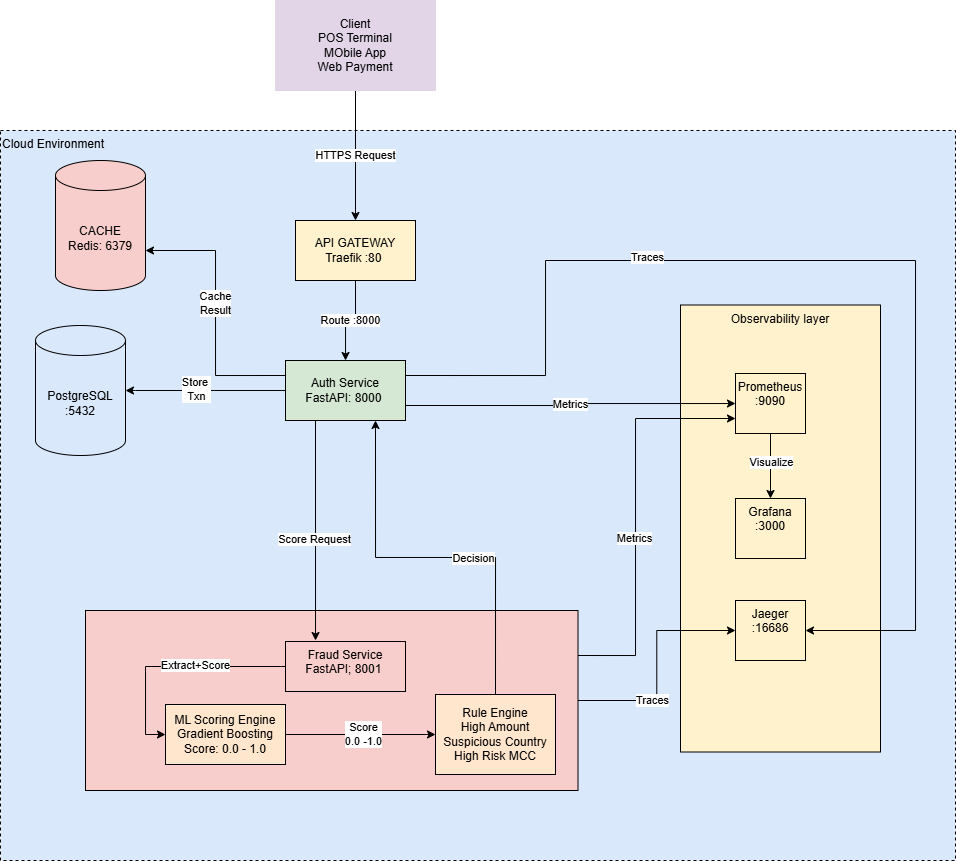

## 🏗️ Architecture Diagram

> 📐 Editable diagram: [docs/txnflow3.drawio](docs/txnflow3.drawio)

Architecture in construction
---

## 🔄 Transaction Flow

| Step | Component | Action |
|------|-----------|--------|
| 1 | 💳 Client | Sends HTTPS payment request |
| 2 | 🌐 API Gateway | Routes to Auth Service :8000 |
| 3 | 🏦 Auth Service | Sends Score Request to Fraud Service |
| 4 | 🤖 ML Scoring Engine | Calculates fraud score 0.0-1.0 |
| 5 | 📋 Rules Engine | Applies business rules |
| 6 | 🔍 Fraud Service | Returns Decision to Auth Service |
| 7 | 🏦 Auth Service | Stores transaction in PostgreSQL |
| 8 | ⚡ Redis | Caches result |
| 9 | 💳 Client | Receives APPROVED ✅ or DECLINED ❌ |

---

## 📦 Components

| Component | Technology | Port | Purpose |
|-----------|-----------|------|---------|
| API Gateway | Traefik | :80 | Routing & Load Balancing |
| Auth Service | FastAPI | :8000 | Transaction Authorization |
| Fraud Service | FastAPI | :8001 | Fraud Detection |
| Database | PostgreSQL | :5432 | Transaction Storage |
| Cache | Redis | :6379 | Speed Layer |
| Metrics | Prometheus | :9090 | Metrics Collection |
| Dashboard | Grafana | :3000 | Visualization |
| Tracing | Jaeger | :16686 | Distributed Tracing |

---

## 📦 Component Descriptions

### 💳 Client
Represents whoever is making a payment:
a person at a store (POS Terminal), using a Mobile App,
or buying online (Web Payment).
Sends the payment request to our system.

---

### 🌐 API Gateway — Traefik :80
The **front door** of the system.
Receives ALL incoming requests and routes them
to the right service.
Also handles load balancing if we have
multiple copies of a service running.

---

### 🏦 Authorization Service — FastAPI :8000
The **brain** of the transaction:
1. Receives payment from API Gateway
2. Asks Fraud Service → *"is this transaction safe?"*
3. Gets fraud decision back
4. Saves transaction to database
5. Returns `APPROVED` ✅ or `DECLINED` ❌ to the client

---

### 🔍 Fraud Prevention Service — FastAPI :8001
The **security guard** of the system.
Receives transaction details from Auth Service,
runs it through ML model + Rules Engine,
and returns a risk score and decision:

| Decision | Score Range | Action |
|----------|-------------|--------|
| ✅ PASS | 0.0 — 0.30 | Approve transaction |
| ⚠️ REVIEW | 0.30 — 0.65 | Request extra verification |
| ❌ BLOCK | 0.65 — 1.0 | Decline transaction |

---

### 🤖 ML Scoring Engine — Gradient Boosting
The **AI brain** inside the Fraud Service.
A trained Machine Learning model that analyzes
patterns and returns a fraud probability score:

| Score | Meaning |
|-------|---------|
| 0.0 | Definitely safe |
| 0.5 | Suspicious |
| 1.0 | Definitely fraud |

---

### 📋 Rules Engine
The **policy checker** inside the Fraud Service.
Simple IF/THEN rules that boost the fraud score
based on known patterns:

| Rule | Risk Added |
|------|-----------|
| Amount > \$5,000 | +0.20 |
| Suspicious Country (NG, RU, KP) | +0.25 |
| High Risk Merchant (Gambling, Crypto) | +0.15 |
| Odd Hours (12am — 4am) | +0.10 |

Works **together** with the ML model for best accuracy.

---

### 🗄️ PostgreSQL — :5432
The **permanent storage** of the system.
Saves every transaction permanently:
- Card details (masked)
- Amount & currency
- Merchant information
- Fraud score & decision
- Timestamp

Used for reporting and audit trails.

---

### ⚡ Redis — :6379
The **speed layer** of the system.
Stores recent results in memory so repeated
requests are answered instantly without
hitting the database every time.

---

### 📊 Prometheus — :9090
The **metrics collector** of the system.
Constantly collects numbers from all services:
- How many requests per second?
- How fast is each service responding?
- How many transactions were declined?
- How many fraud attempts detected?

---

### 📈 Grafana — :3000
The **dashboard** of the system.
Takes data from Prometheus and shows it
as beautiful charts and graphs in real time.

---

### 🔎 Jaeger — :16686
The **detective** of the system.
Tracks a single transaction ALL the way
through every service:
Helps find where slowdowns happen.

---

